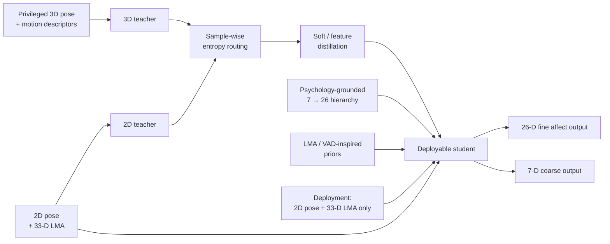

# Privacy-Preserving Bodily Emotion Recognition

[](https://doi.org/10.1016/j.aiopen.2026.08.001)
[](https://github.com/296466042Shuang/dual-teacher-emotion-recognition/actions/workflows/smoke-test.yml)


**Dual-teacher knowledge distillation for in-the-wild skeleton-based emotion recognition**

Research project accompanying:

**Shuang Wu and Daniela M. Romano**  
*Privacy-preserving in-the-wild bodily expressed emotion recognition: A dual-teacher distillation framework with psychological priors*  
**AI Open (2026), 7, 248–275**  
DOI: https://doi.org/10.1016/j.aiopen.2026.08.001

> **Public-code note:** this repository contains a compact reference implementation reconstructed around the published method and deployment interface. It is intended to communicate the modelling design clearly; it is **not** the exact internal training code used to produce the paper's reported benchmark numbers. Dataset-specific preprocessing, trained weights, private experiment orchestration, and some research artefacts are not released here.

## Why this problem?

Skeleton-only affect recognition is attractive for privacy-sensitive deployment because it avoids relying on facial appearance, texture, and much of the surrounding scene. The challenge is that real-world 2D pose is noisy, incomplete, viewpoint-dependent, and affected by occlusion.

The central idea of DT-KD is therefore to use **richer supervision during training** while retaining a lightweight sensing requirement at deployment.

## Method at a glance



The framework combines three complementary components:

1. **Privileged 3D teacher** — provides cleaner kinematic supervision that is unavailable at deployment time.
2. **Modality-aligned 2D teacher** — operates closer to the final sensing condition and helps bridge the lab-to-field gap.
3. **Deployable student** — retains only 2D pose-derived information and 33-D LMA features at inference.

The public code also illustrates sample-wise entropy routing between teachers, fine/coarse prediction heads corresponding to the psychology-grounded 7→26 structure, feature alignment, and optional prototype regularisation.

A broader research question behind this work is:

> **Which latent information remains recoverable when sensing observations are noisy, incomplete, or constrained by privacy requirements?**

## What this repository demonstrates

This repository is intentionally compact. It exposes the parts that are most useful for understanding the modelling design and deployment interface.

| Component | Public reference |
| --- | --- |
| Temporal 2D/3D pose encoder | ✓ |
| Privileged 3D teacher | ✓ |
| Modality-aligned 2D teacher | ✓ |
| Deployment-time student | ✓ |
| 33-D LMA interface | ✓ |
| Sample-wise entropy routing | ✓ |
| Soft / feature distillation | ✓ |
| 7-way coarse + 26-way fine heads | ✓ |
| Synthetic inference demo | ✓ |
| One-step training smoke test | ✓ |
| Restricted datasets | Not redistributed |
| Paper checkpoints | Not redistributed |
| Exact private experiment orchestration | Not redistributed |

## Repository structure

```text
.
├── .github/
│   └── workflows/
│       └── smoke-test.yml
├── assets/
├── configs/
│   └── example.yaml
├── demo/
│   └── inference_demo.py
├── examples/
├── src/
│   ├── datasets/
│   ├── features/
│   │   └── lma.py
│   ├── models/
│   │   ├── common.py
│   │   ├── distillation.py
│   │   ├── student.py
│   │   └── teachers.py
│   └── utils/
│       └── metrics.py
├── tests/
│   └── test_shapes.py
├── CITATION.cff
├── train_reference.py
├── requirements.txt
└── README.md
```

## Installation

Python 3.10+ and PyTorch are recommended.

```bash
git clone https://github.com/296466042Shuang/dual-teacher-emotion-recognition.git
cd dual-teacher-emotion-recognition
pip install -r requirements.txt
```

## Quick start

### Deployment-time inference

Run the student on synthetic **2D pose + 33-D LMA** input:

```bash
python demo/inference_demo.py
```

The demo verifies the deployment interface:

```text
2D pose:            [B, T, J, 2]
LMA descriptor:     [B, 33]
Fine affect output: [B, 26]
Coarse output:      [B, 7]
```

### Distillation smoke test

Run a single synthetic DT-KD optimisation step:

```bash
python train_reference.py
```

This instantiates both teachers, routes their predictions sample by sample, distils them into the student, and performs one gradient update.

These scripts are **interface and implementation smoke tests**. They do not reproduce the paper's reported benchmark numbers.

## Core model interface

```python
from src.models import StudentModel

student = StudentModel(
    num_joints=17,
    lma_dim=33,
    feature_dim=96,
)

output = student(pose_2d, lma_33d)

fine_logits = output["logits_26"]
coarse_logits = output["logits_7"]
```

At deployment, the 3D teacher, 2D teacher, and privileged 3D observations are not required.

## Public-release boundary

### Included

- model interfaces and compact PyTorch modules;
- entropy-routed dual-teacher distillation;
- LMA feature validation / standardisation;
- synthetic examples and configuration;
- evaluation helper utilities.

### Not included

- raw BoLD, EMOTIC, or other restricted datasets;
- dataset-specific research preprocessing pipelines;
- checkpoints used for the paper;
- exact paper-specific LMA/VAD prototype values;
- complete ablation / experiment orchestration;
- private cluster paths and internal research utilities.

This separation is intentional: the repository communicates the **research mechanism and deployment contract** without redistributing restricted data or internal experimental infrastructure.

## Testing

A small shape/interface test is included:

```bash
python -m unittest tests.test_shapes
```

GitHub Actions also runs the public inference and training smoke tests on repository updates.

## Data

The original experiments use research datasets subject to their respective licences and access conditions. Raw datasets are therefore **not redistributed through this repository**.

Only synthetic or non-sensitive inputs are used by the public examples.

## Citation

If this repository or the associated paper is useful in your work, please cite:

```bibtex
@article{wu2026privacy,
  title={Privacy-preserving in-the-wild bodily expressed emotion recognition: A dual-teacher distillation framework with psychological priors},
  author={Wu, Shuang and Romano, Daniela M.},
  journal={AI Open},
  volume={7},
  pages={248--275},
  year={2026},
  doi={10.1016/j.aiopen.2026.08.001}
}
```

Machine-readable citation metadata are also provided in `CITATION.cff`.

## Model card

A compact model card covering intended use, inputs, limitations, privacy considerations, and out-of-scope use is provided in [MODEL_CARD.md](MODEL_CARD.md).

## Broader sensing perspective

Although the application here is bodily affect recognition, the underlying learning problem is more general: a target latent signal must be recovered from observations that are incomplete, noisy, and mixed with nuisance variation. The design therefore emphasises privileged supervision, modality alignment, confidence-aware distillation, and a constrained deployment interface.

This perspective is relevant to other sensing problems in which the information available during training is richer than the information available at deployment.

## Research context

This project sits within broader work on:

- temporal human-behaviour modelling,
- privacy-preserving computer vision,
- multimodal sensing,
- knowledge distillation,
- representation learning under noisy or partial observations,
- and deployment-aware human-centred AI.

## Authors

**Shuang Wu** — University College London (UCL)  
**Daniela M. Romano**

## Licence

No blanket software licence is granted yet. A licence will be added after the public release has been checked for third-party code and data dependencies.
